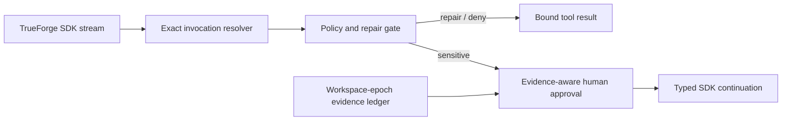
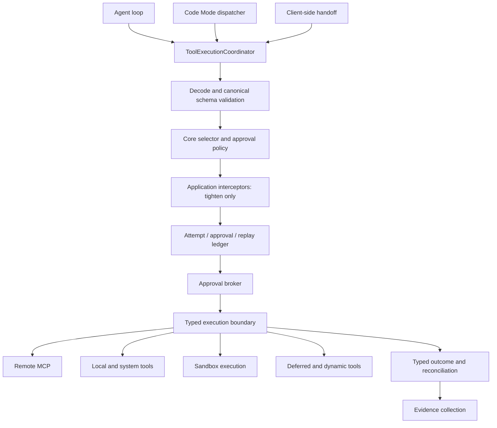

# Architecture

## The shape of the system

```
        ┌──────────────┐
        │  Sentry      │  production errors
        └──────┬───────┘
               │ MCP (read-only)
               ▼
  ┌────────────────────────────┐        ┌──────────────────┐
  │   TrueForge server         │◄──────►│  Model provider  │
  │   · agent loop             │        │  (any, swappable)│
  │   · credentials            │        └──────────────────┘
  │   · approval enforcement   │
  └───┬──────────────────┬─────┘
      │                  │ MCP (writes gated)
      │ sandbox-as-tool  ▼
      │            ┌──────────────┐
      ▼            │   GitHub     │
┌─────────────┐    └──────────────┘
│  Sandbox    │           ▲
│  · repro    │           │ pull request
│  · tests    │           │
│  · NO creds │      ┌────┴─────┐
└─────────────┘      │   Qodo   │ automated review
                     └──────────┘
        ▲
        │ stream / approvals
  ┌─────┴──────────────────┐
  │  This repo (SDK client)│  provision · dispatch · doctor
  └────────────────────────┘
```

Three processes, clearly separated:

1. **The TrueForge server** runs the agent loop and holds every credential. It is the only component that talks to the model, the MCP servers, and the sandbox.
2. **The sandbox** executes code. It is provisioned on demand, holds no secrets, and is thrown away.
3. **This repository** is a thin SDK client. It defines the agent, opens sessions, renders the stream, and relays human decisions.

## Why the sandbox is a tool, not a home

Many harnesses run the whole agent *inside* a VM. TrueForge runs the loop on the server and treats the sandbox as one more tool it can call.

That choice is what makes the safety story work here. If the agent lived inside the sandbox, the GitHub token would have to live there too — and the untrusted code the agent writes in stage 3 would run next to it. Because the loop stays on the server, code execution and credential custody are in different places by construction, not by discipline.

It is also cheaper: stages 1–2 are pure reads and never provision a sandbox at all.

## Where the gate sits, and why there

The gate is on the **tool call**, not on the final answer.

Putting a human at the end — "here's a diff, ship it?" — sounds equivalent but isn't. The dispatch runtime therefore gates the individual required action and resolves every `toolCalls[]` reference to the exact call ID before displaying it. Approval is bound to the session, turn, thread, call ID, canonical-argument fingerprint, and policy version; a semantic correction gets a new call ID and a fresh approval.

This is a **dispatch-boundary control**, not a claim that the SDK can intercept a call TrueForge core has already allowed. TrueForge still performs its own server-side approval enforcement. Comprehensive coverage of remote MCP, local/system tools, sandbox execution, client tools, and nested Code Mode calls requires the core `ToolExecutionCoordinator` described below.

## Turn lifecycle

A repair is several turns, not one:

```
turn 1   user.message ──► read, reason, reproduce, patch
                          └─► tool.approval_required (create_branch)   ⏸ turn ends

turn 2   user.tool_approval {allow} ──► branch created, files pushed
                          └─► tool.approval_required (create_pull_request)   ⏸ turn ends

turn 3   user.tool_approval {allow} ──► PR opened ──► turn.done, nothing pending
```

`src/runtime/run.ts` drives this: stream a turn, collect whatever it paused on, resolve it with a human, open the next turn. It loops until a turn finishes with no pending actions, bounded by `MAX_TURNS` so a pathological run cannot spin forever.

Turns chain automatically (`previous_turn_id` defaults to `auto`), so the agent keeps full context across the pauses without the client resending history.

## Failure modes we designed for

| Failure | Response |
| --- | --- |
| Agent can't reproduce the bug | Instructed to report it and stop, never to patch blind |
| Agent invents a passing test suite | Instructions forbid it; the sandbox output is in the trace for a human to check |
| Nobody is at the terminal | `approvals.ts` denies every pending write — fails closed |
| Operator walks away mid-prompt | Ctrl-C denies the write in front of them and every one behind it |
| Agent tries to patch its own gate | `perimeter.ts` refuses it before a human is asked |
| Agent pastes a token into the patch | `secrets.ts` refuses the payload before a human is asked |
| Someone widens the perimeter in a PR | CI asserts the control plane is unreachable; the PR fails |
| Someone edits the agent in the UI | `npm run doctor` compares the server's gate against the repo's spec |
| Runaway agent loop | `iteration_limit: 120` in the spec; `MAX_RESUMES` in the client |
| Connector unauthorized mid-demo | `npm run doctor` catches it before you start |
| Oversized tool output floods context | Harness large-response offloading writes it to a sandbox file |
| An event type we've never seen | The renderer tolerates unknown types rather than crashing the run |
| "What did it actually do?" after the fact | `journal.ts` — a hash-chained record of every decision, verifiable later |

## Three checks, in the order they run

A gated tool call passes through three things before anyone is asked, and the order is the design:

```
tool.approval_required
        │
        ▼
  1  write perimeter    where?   ── outside ──►  DENIED, no human asked
        │ inside
        ▼
  2  credential tripwire what?   ── found ────►  DENIED, no human asked
        │ clean
        ▼
  3  the human           should we?            ── no TTY / Ctrl-C ──► DENIED
        │
        ▼
     approved  ──►  the call runs

  every outcome above ──►  appended to the decision journal
```

The first two refuse rather than warn. That is the whole argument: a boundary an operator can be walked through at 3am is a boundary that will be walked through at 3am, and the two questions those stages answer — *is this file mine to write?* and *is this payload a credential?* — are exactly the two a tired human is worst at. The third question, *is this the right fix?*, is the one only a person can answer, and it is the only one they are asked.

## Deliberate limitations

- **One repository per deployment.** `LTP_TARGET_REPO` is a single repo by design. A multi-repo agent needs a permission model this hackathon build doesn't have.
- **Sentry is the only incident source.** The playbook generalizes to any error tracker with an MCP server; only Sentry is wired.
- **The gate is per-call, so a large fix means several prompts.** That is the intended trade. Batching approvals would put distance back between what is approved and what runs.
- **The perimeter and the tripwire live in the client, not the harness.** They govern `npm run dispatch`, which is the operating path — but they are not properties of the agent itself. See [SECURITY.md](../SECURITY.md) for what that does and does not buy you.
- **The journal proves integrity, not identity.** It detects an edited or reordered record; it does not attest to who was at the keyboard. Signing it would need a key, and a key would need somewhere safe to live.

## Verified self-healing tool-call firewall

### Hackathon boundary and invariants

The committed implementation lives at Licence to Patch's existing SDK required-action boundary:



It enforces these invariants:

1. Every reference in `toolCalls[]` is resolved against its named source event and exact call ID; unresolved or ambiguous references fail closed.
2. `tool.approval_required` produces `user.tool_approval`; `tool.response_required` produces `user.tool_response`. They are never conflated.
3. GitHub policy is bound to the configured MCP `serverName` and stable `serverId`, then repository, path, secret, protected-branch, destructive-tool, and known-schema policy is evaluated from actual arguments before a prompt appears.
4. Repair feedback is structured and bounded to two attempts. The original call is never mutated or replayed, and a repeated fingerprint opens the circuit.
5. Approval is keyed by session, turn, thread, call ID, HMAC argument fingerprint, and policy version. Changed semantics or a new call ID require another decision.
6. Duplicate required actions replay the recorded decision without another prompt or gate attempt. Human denial terminates that repair chain.
7. Test evidence requires an exactly configured, non-composed command, exact response correlation, an exact configured host producer identity, and a fixed top-level execution-facts envelope with completion, timeout, status, and exit code. Opaque SDK strings—including JSON-looking strings—and same-named untrusted producers remain unverified.
 8. Content mutations (file writes, merges) increment `workspaceEpoch` and invalidate older current-state evidence. A pre-fix regression record is exempt by design - the red run necessarily precedes the fix write - as are publication tools (`create_pull_request` and issue/PR metadata), which change no code the tests executed against.
9. Only explicit `done` closes an incident. `error`, `cancelled`, unknown, and nonterminal no-action states fail closed.
10. Core TrueForge policy can only be tightened here; an application allow can never bypass a server-required approval.

The implementation is intentionally in-memory for one dispatch process. Durable crash recovery belongs in the core store, below. The demo command is fully offline:

```powershell
npm run demo:firewall
```

### Decision precedence

```text
core deny
  > application deny
  > repair
  > application require approval / human review
  > core require approval
  > allow
```

The current SDK receives calls only after TrueForge has emitted a required action, so it does not claim to be the universal pre-execution seam.

## Production extension: TrueForge ToolExecutionCoordinator

Production TrueForge should introduce one canonical execution service and make direct `IToolSet.callTool()` access internal:



Canonical interfaces:

```ts
interface ToolExecutionCoordinator {
  prepare(invocation: ToolInvocation): Promise<PreparedToolInvocation>;
  execute(prepared: PreparedToolInvocation): Promise<ToolExecutionOutcome>;
  reconcile(invocationKey: ToolInvocationKey): Promise<ReconciliationOutcome>;
}

interface ToolExecutionInterceptor {
  evaluate(
    invocation: Readonly<ToolInvocation>,
    coreDecision: Readonly<CoreToolDecision>,
  ): Promise<PolicyDecision>;
  observe(outcome: Readonly<ToolExecutionOutcome>): Promise<void>;
}
```

Interceptor errors and timeouts fail closed. Interceptors may tighten but never weaken `coreDecision`. Core remains the owner of canonical Zod schemas, enabled/disabled selectors, annotations, sandbox availability, client-tool requirements, and secret-safe rendering.

### Batch preflight and model compatibility

`executeToolCalls.ts` should resolve, decode, validate, classify, and persist every call before any eligible side effect starts. Calls whose policy and approval are final may execute in parallel; a write waiting for approval never starts. Every model-produced call still receives one corresponding tool result, including repair, denial, unknown-tool, and interceptor-failure results.

### Nested Code Mode identity

Sandbox-originated calls carry a trusted host envelope:

```ts
interface CodeModeInvocationContext {
  session_id: string;
  turn_id: string;
  thread_id: string;
  parent_tool_call_id: string;
  nested_call_sequence: number;
}
```

The host validates the active parent/session/sandbox relationship and derives `code:<parent_tool_call_id>:<sequence>`. Trace IDs are observability metadata, not approval identity.

### Typed outcomes and ambiguous writes

```ts
interface ToolExecutionOutcome {
  invocationKey: ToolInvocationKey;
  attemptId: string;
  status: 'succeeded' | 'failed' | 'unknown';
  failureClass?: FailureClass;
  startedAt: string;
  completedAt: string;
  response: CallToolResult;
  executionFacts?: {
    exitCode?: number;
    timedOut?: boolean;
    signal?: string;
    sideEffectCommitted?: boolean;
  };
}
```

Read-only calls may retry within a host budget. Native-idempotent writes reuse the same key. Reconcilable writes query remote state before retry. Destructive and non-idempotent writes in an ambiguous `executing` state become `unknown` and require a human; they are never blindly replayed.

### Persistence and recovery

Attempt and approval records extend the existing TrueForge session store in both SQLite and Postgres—no new database product. Before dispatch, the coordinator persists `approved`, atomically transitions to `executing`, and obtains an idempotency key. On restart:

| Persisted state | Recovery |
| --- | --- |
| `prepared` | Re-evaluate current policy version |
| `awaiting_approval` | Re-display the same required action |
| `approved` | Start only the exact fingerprinted call |
| `executing`, read-only | Retry within budget |
| `executing`, native-idempotent | Reissue with the same key |
| `executing`, reconcilable write | Query remote state first |
| `executing`, non-idempotent write | Mark unknown and request human review |
| terminal | Never replay |

Canonical Zod event schemas add `tool.gate_decision`, `tool.repair_requested`, `tool.attempt_started`, `tool.attempt_completed`, and `tool.evidence_updated`; OpenAPI and SDK artifacts are regenerated rather than hand-edited.

### Metrics

Counters include gate decisions/reasons, repair attempts/success/exhaustion, blocked replays, invalidated approvals, unknown outcomes, evidence states, fail-closed events, and gate/execution latency. Metric labels never include raw arguments, command output, secrets, or repository contents.
